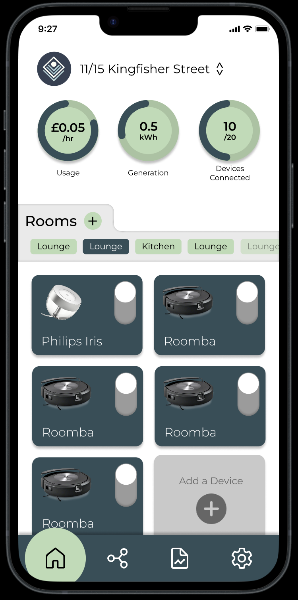
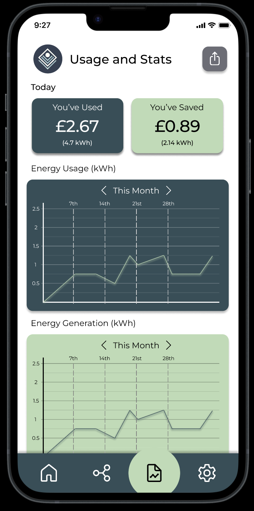

# Lumina


<div style="text-align: center;">
  
  
</div>

<div style="text-align: center;">
    
</div>
<div style="text-align: center;">
    
    
    
</div>

## Overview

Lumina is a smart home application developed by Haven Solutions. Designed for both mobile and desktop platforms, Lumina offers seamless control and monitoring of your smart home devices. Built using Flutter, Dart, and C, it provides a responsive and intuitive user interface complemented by robust performance.

## Features

- **Monitoring and Controlling Devices**: Monitor and control all of your smart home devices seamlessly.
- **Desktop and Mobile**: Available on both desktop and mobile platforms for versatile usage.
- **Comprehensive Statistics**: View extensive statistics about different rooms and devices to stay informed.
- **Organise into Rooms**: Organise your devices into specific rooms for easier management and navigation.

## Technologies Used

- **Flutter**: For building the cross-platform user interface.
- **Dart**: Programming language for Flutter development.
- **C**: Utilised for real-time data simulation.
- **Icons8**: Source of application icons.

## Installation

### Prerequisites

- [Flutter](https://flutter.dev/docs/get-started/install) installed on your machine.
- [Dart](https://dart.dev/get-dart) SDK.
- A C compiler (e.g., GCC) (for simulation data).
- [Chrome](https://www.google.com/chrome/) (For Web)

### Steps

1. **Clone the Repository**

   ```bash
   git clone https://github.com/havensolutions/lumina.git
2. **Get the Dependencies**

   ```bash
   flutter pub get
3. **Run the Web App**
   
   ```bash
   flutter run -d chrome